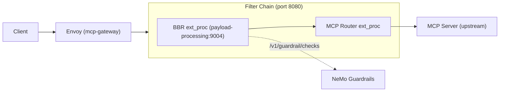
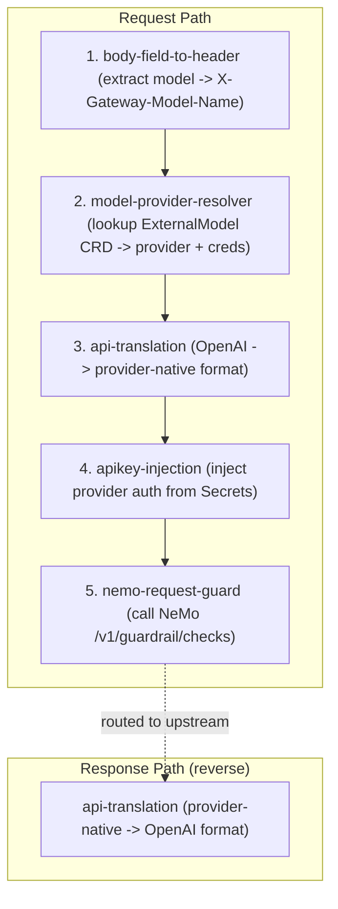

# Guardrailing the MCP Gateway

## Deployment Topology

```
Namespace: gateway-system
  ├── Gateway/mcp-gateway (Istio-managed Envoy proxy)
  ├── Route/mcp-gateway
  └── Deployment/payload-processing

Namespace: istio-system
  └── EnvoyFilter (injects MCP router ext_proc into Gateway)

Namespace: mcp-system
  ├──
  ├── Deployment/mcp-broker-router (Broker :8080, Router ext_proc :50051)
  ├── Deployment/mcp-controller
  ├── ConfigMap/mcp-gateway-config
  └── Secret/mcp-aggregated-credentials

Namespace: trustyai-guardrails
  └── NemoGuardrails CR → Operator creates:
      ├── Deployment/<cr-name>         (NeMo server on :8000)
      ├── Service/<cr-name>            (ClusterIP, port 80 → 8000)
      ├── ConfigMap/<cr-name>-ca-bundle
      └── Route/<cr-name>              (OpenShift only)
```

## Request Pathway



## Plugin Chain



## Prerequisites

1. RHOAI operator installed with `trustyai` set to `Removed` in the DSC

  ```
  kind: DataScienceCluster
  apiVersion: datasciencecluster.opendatahub.io/v2
  metadata:
    labels:
      app.kubernetes.io/name: datasciencecluster
    name: default-dsc
  spec:
    ...
    trustyai:
      managementState: Removed
  ```

2. Create a working directory for cloned repos and generated files:

  ```
  export WORKDIR=$(pwd)/tmp
  mkdir -p ${WORKDIR}
  ```

## Deploy the MCP Gateway

Run the following script to:

- Install the required operators (Service Mesh, Connectivity Link, and MCP Gateway Controller)
- Install MCPGateway CRDs (MCPGatewayExtensions, MCPServerRegistrations)
- Deploy an MCPGateway instance and create an external route

```bash
git clone --depth 1 https://github.com/Kuadrant/mcp-gateway.git \
  ${WORKDIR}/mcp-gateway

cd ${WORKDIR}/mcp-gateway && ./config/openshift/deploy_openshift.sh
```

The MCP Gateway is accessible via:
```
echo https://$(oc get routes -n gateway-system -o jsonpath='{ .items[0].spec.host }')/mcp
```

## Deploy MCP Servers

Run the following command to:

* Deploy MCP servers, `mcp-test-server1` and `mcp-test-server3`
* Create HTTPRoutes for the MCP servers
* Register them to be discovered and routed by the MCP Gateway

```
oc apply -f ${WORKDIR}/manifests/mcp_servers.yaml
```

### Verify the MCP Gateway

Get the MCP Gateway URL and initialize an MCP session:

```
export MCP_URL=https://$(oc get routes -n gateway-system -o jsonpath='{ .items[0].spec.host }')/mcp

SESSION=$(curl -si --max-time 10 ${MCP_URL} \
  -H "Content-Type: application/json" \
  -d '{"jsonrpc":"2.0","id":1,"method":"initialize","params":{"protocolVersion":"2025-03-26","capabilities":{},"clientInfo":{"name":"test","version":"1.0"}}}' \
  2>/dev/null | grep -i mcp-session-id | tr -d '\r' | awk '{print $2}')

echo "Session: ${SESSION}"
```

List available tools:

```
curl -s --max-time 10 ${MCP_URL} \
  -H "Content-Type: application/json" \
  -H "Mcp-Session-Id: ${SESSION}" \
  -d '{"jsonrpc":"2.0","id":2,"method":"tools/list","params":{}}' \
  | jq -r '.result.tools[].name'
```

## Deploy the NeMo Guardrails Server

Create a namespace for the TrustyAI Guardrails Operator:

```
oc new-project trustyai-guardrails-operator-system
```

Run the following command to install the operator and CRDs:

```bash
oc apply -f https://raw.githubusercontent.com/trustyai-explainability/trustyai-guardrails-operator/main/release/trustyai_guardrails_bundle.yaml \
  -n trustyai-guardrails-operator-system

oc wait --for=condition=ready pod \
  -l control-plane=controller-manager \
  -n trustyai-guardrails-operator-system \
  --timeout=300s
```

Deploy a `phi-3` model:

```bash
oc new-project trustyai-guardrails

oc apply -f manifests/model_container.yaml -n trustyai-guardrails

oc wait --for=condition=ready pod \
  -l app=minio-llms \
  -n trustyai-guardrails \
  --timeout=300s

oc apply -f manifests/phi.yaml -n trustyai-guardrails

sleep 10

oc wait --for=condition=ready pod \
  -l serving.kserve.io/inferenceservice=phi3 \
  -n trustyai-guardrails \
  --timeout=300s
```

Get the model endpoint and update `manifests/config.yaml`:

```bash
export MODEL_ENDPOINT=http://$(oc get inferenceservice phi3 \
  -n trustyai-guardrails \
  -o jsonpath='{.status.url}' | sed 's|https\?://||')/v1

sed -i "s|<MODEL_ENDPOINT>|${MODEL_ENDPOINT}|" manifests/config.yaml
```

Apply the NeMo Guardrails configuration and deploy the server:
```
oc apply -f ${WORKDIR}/manifests/config.yaml

sleep 10

oc wait --for=condition=ready pod \
  -l app=example-nemoguardrails \
  -n trustyai-guardrails \
  --timeout=300s
```

The NeMo Guardrails server is configured with the following input rails:

- **Sensitive data detection** -- detects PII such as credit card numbers, SSNs, emails, and phone numbers
- **Jailbreak detection heuristics** -- detects character-level jailbreak attacks (prefix/suffix perturbation)

### Verify NeMo Guardrails

Test the NeMo `/v1/guardrail/checks` endpoint directly:

```
export NEMO_URL=https://$(oc get route example-nemoguardrails -o jsonpath='{.spec.host}' -n trustyai-guardrails)/v1/guardrail/checks

# PII (expected: "status": "blocked")
curl -s --max-time 30 ${NEMO_URL} \
  -H "Content-Type: application/json" \
  -d '{"model":"phi3","messages":[{"role":"user","content":"My credit card is 4111-1111-1111-1111 and SSN is 123-45-6789"}]}'

# Clean input (expected: "status": "success")
curl -s --max-time 30 ${NEMO_URL} \
  -H "Content-Type: application/json" \
  -d '{"model":"phi3","messages":[{"role":"user","content":"What is the weather like today?"}]}'
```

## Install Payload Processing

Install the ExternalModel CRD:

```
oc apply -f https://raw.githubusercontent.com/opendatahub-io/models-as-a-service/refs/heads/main/deployment/base/maas-controller/crd/bases/maas.opendatahub.io_externalmodels.yaml
```

Export `GATEWAY_NAME` and `GATEWAY_NAMESPACE`  environment variables:

```
export GATEWAY_NAME=mcp-gateway
export GATEWAY_NAMESPACE=gateway-system
```

Replace NEMO_GUARDRAILS_URL in `manifests/values.yaml`:

```
  json:
            nemoURL: <NEMO_GUARDRAILS_URL>/v1/guardrail/checks
```

Install `payload-processing` via Helm:

```bash
git clone --depth 1 \
  https://github.com/opendatahub-io/ai-gateway-payload-processing.git \
  ${WORKDIR}/ai-gateway-payload-processing

helm install payload-processing \
  ${WORKDIR}/ai-gateway-payload-processing/deploy/payload-processing \
  --namespace gateway-system \
  --dependency-update \
  -f manifests/values.yaml
```

### Verify BBR + NeMo Guardrails

Send a clean tool call (expected: allowed):

```
curl -s --max-time 15 ${MCP_URL} \
  -H "Content-Type: application/json" \
  -H "Mcp-Session-Id: ${SESSION}" \
  -d '{"jsonrpc":"2.0","id":3,"method":"tools/call","params":{"name":"cal_greet","arguments":{"name":"hello world"}}}'
```

Send PII -- credit card and SSN (expected: blocked):

```
curl -s --max-time 15 ${MCP_URL} \
  -H "Content-Type: application/json" \
  -H "Mcp-Session-Id: ${SESSION}" \
  -d '{"jsonrpc":"2.0","id":4,"method":"tools/call","params":{"name":"cal_greet","arguments":{"name":"My credit card is 4111-1111-1111-1111 and SSN is 123-45-6789"}}}'
```

Send PII -- email and phone number (expected: blocked):

```
curl -s --max-time 15 ${MCP_URL} \
  -H "Content-Type: application/json" \
  -H "Mcp-Session-Id: ${SESSION}" \
  -d '{"jsonrpc":"2.0","id":5,"method":"tools/call","params":{"name":"cal_greet","arguments":{"name":"Send invoice to john.doe@example.com or call 555-123-4567"}}}'
```

Check BBR logs to confirm NeMo decisions:

```
oc logs deployment/payload-processing -n gateway-system --tail=30 \
  | grep -E "allowed by NeMo|blocked by NeMo"
```

Expected output:

```
"msg":"request allowed by NeMo guardrails"
"msg":"request blocked by NeMo guardrails","railsStatus":"[ detect sensitive data on input: blocked ]"
"msg":"request blocked by NeMo guardrails","railsStatus":"[ detect sensitive data on input: blocked ]"
```

##

## References

1. [https://github.com/Kuadrant/mcp-gateway/tree/main/config/openshift](https://github.com/Kuadrant/mcp-gateway/tree/main/config/openshift)
2. [https://github.com/trustyai-explainability/trustyai-guardrails-operator/blob/main/docs/nemo_guardrails_quickstart.md](https://github.com/trustyai-explainability/trustyai-guardrails-operator/blob/main/docs/nemo_guardrails_quickstart.md)
3. [https://github.com/opendatahub-io/ai-gateway-payload-processing/pull/85](https://github.com/opendatahub-io/ai-gateway-payload-processing/pull/85)

